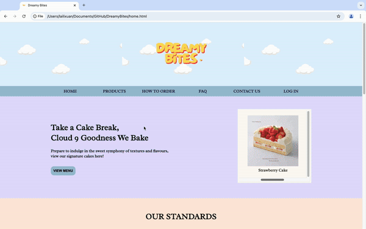

# Dreamy Bites
Dreamy Bites is a bakery website created to provide users with an easy and delightful online shopping experience. The website features **16 pages** designed with a focus on accessibility and user experience. 

## Pages Overview
### 1. Home Page
The home page serves as the introduction to Dreamy Bites. It is structured into different sections, each containing unique content:

- **Menu Preview**: A brief overview of our offerings with a call-to-action button to view the full menu.
- **Product Standards**: A section that highlights the quality of our products.
- **Order Page Link**: A button to direct users to the **How to Order** page.
- **Store Information**: Details about the physical bakery shop.
- **About Us**: A short biography about Dreamy Bites and our story.

### 2. Products Page
The products page displays a list of available bakery items. 
For each individual product page, it includes:
- **Product Images**: A larger left section displaying product photos with a navigation button to cycle through images. 
- **Product Description**: A brief paragraph describing the delightful flavor of our cakes, using a soothing baby blue background to evoke a sense of sweetness and elegance.
- **Product Details**: The product name, detailed description, and key information about the product's ingredients and allergens, displayed in an easy-to-read format.
- **Main Ingredients**: An overview of the product's ingredients to provide transparency to customers.

### 3. How to Order Page
The "How to Order" page explains the process of purchasing from Dreamy Bites. It provides step-by-step instructions on how to place an order online, payment options available, delivery information, and expected delivery times.

### 4. FAQ Page
The FAQ page addresses common questions customers might have, such as ingredient sourcing, customization options, delivery areas, and refund policies. It provides quick answers to help users find the information they need without having to contact customer service.

## Program Details
- HTML
- CSS
- JavaScript
- [Figma](https://www.figma.com/proto/sIJOqDvpcOeesiqeLwgbIj/Dreamy-Bites-Prototype?page-id=0%3A1&node-id=4-2&node-type=canvas&viewport=325%2C537%2C0.07&t=OwS3ptoJ0x1VtmIA-1&scaling=contain&content-scaling=fixed&starting-point-node-id=4%3A2&show-proto-sidebar=1)
